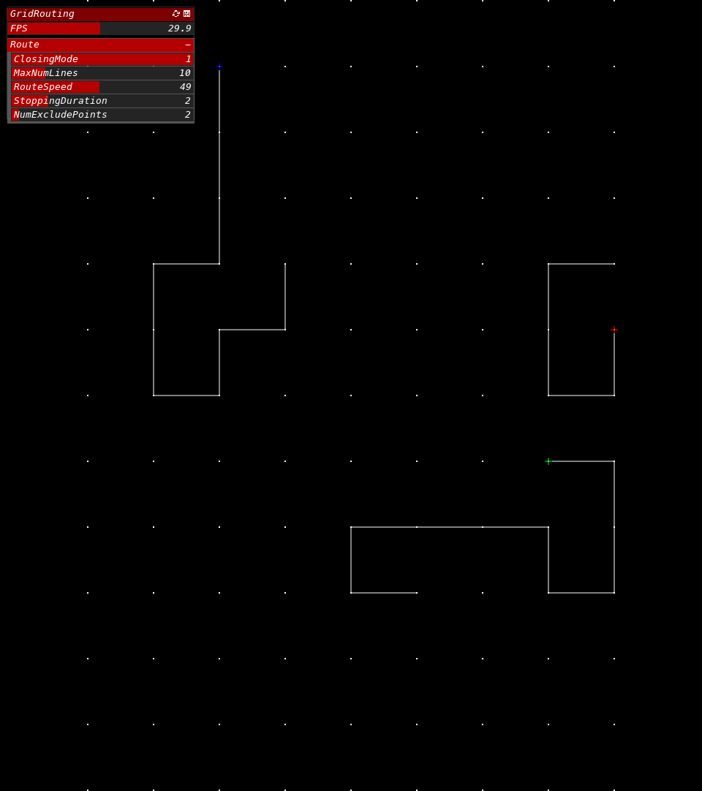

# GridRouting
---
グリッドのルーティング。  
  
  
  
# GUI
---
`[ int ] ClosingMode` : ルートを消すときのモード( `0` -> `CLOSING_ALPHA`, `1` -> `CLOSING_TRACE` )  
`[ int ] MaxNumLines` : ルートの線の最大数  
`[ int ] RouteSpeed` : ルートの進むスピード  
`[ float ] StoppingDuration` : ルートが伸びきってから消え始めるまでの待機時間  
`[ int ] NumExcludePoints` : 除外する自分の前回のルートの直近の点の数  