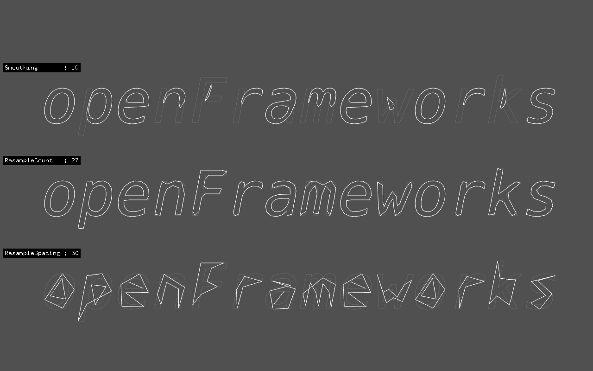

# ofPolyline
---
ofPolylineの再サンプリング。  
  
  

## Point
---
- `ofTrueTypeFont`で輪郭を使いたいときは`font.load( fileName, fontSize, true, true, true )`と書く
- `ofPolyline::getSmoothed()`で滑らかにしたofPolylineを取得
- `ofPolyline::getResampledByCount()`で指定した頂点数で再サンプルしたofPolylineを取得（必ずしも指定数ぴったりになるとは限らない）
- `ofPolyline::getResampledBySpacing()`で指定した長さおきに再サンプルしたofPolylineを取得
- `font.getStringAsPoints()`で取れるのは`vector< ofTTFCharacter >`
- `ofTTFCharacter`は`ofPath`の名前違い
- `ofPath::getOutline()` で取れるのは`vector< ofPolyline >`
- `transform()`を使うとfor文をまわさずにコンテナの要素を一括で操作できる
- 最後の頂点と最初の頂点の間が途切れるときは、最後に最初の頂点を足してつなげる`polyline.addVertex( polyline.getVertices().front() )`