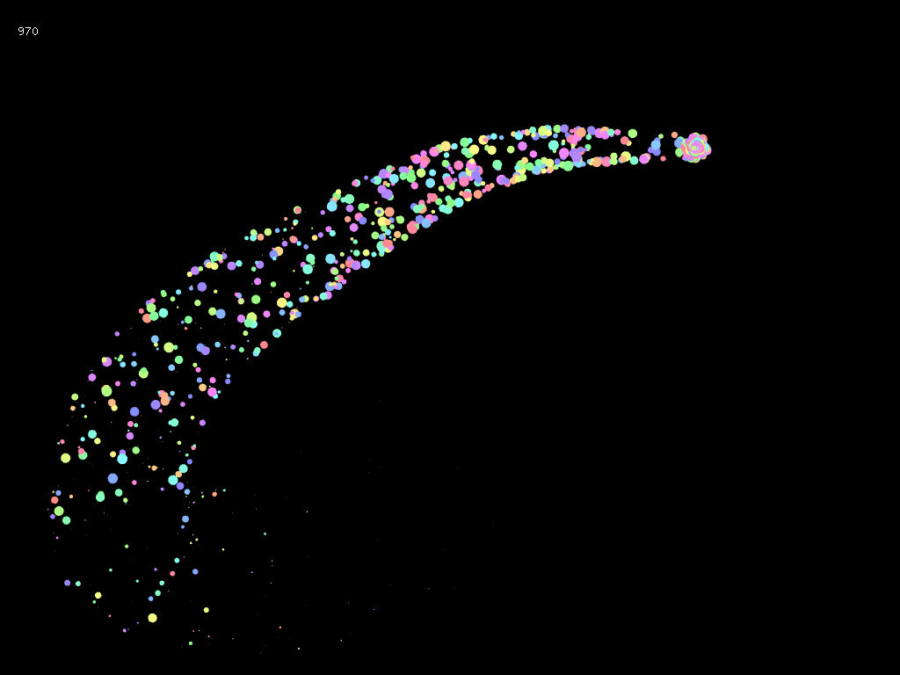

# Particle
---
シンプルなパーティクルクラス実装の例。  
マウス押下でマウス座標からパーティクル生成。  
  

## Point
---
- ヘッダファイルの先頭行にはインクルードガード`#pragma once`を記述する
- ヘッダのクラス宣言内でメンバ関数の定義まで記述すると自動的に`inline`関数になる。
- メンバ変数の初期化には`Member Initializer`を使用する
- `auto`型は代入されたオブジェクトの型を推論する
- コンテナのループ処理には範囲ベースfor文`Range Based for loop`が便利 `for(auto& p : particles) p.update();`
- 関数オブジェクトの記述にはラムダラムダ関数`Lambda Functions`が便利`[キャプチャ](引数){処理;}`
- コンテナの要素削除には`ofRemove(vector<T>,BoolFunction)`を使用する
- `vector.emplace_back(引数)`で要素追加するとコピーが起きずにコンテナ内でオブジェクト生成される
- 変数そのものを書き換えたいときはポインタ`Arg*`か左辺値（名前付きオブジェクト）参照`Arg&`を使用する
